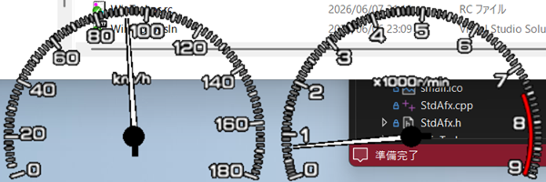
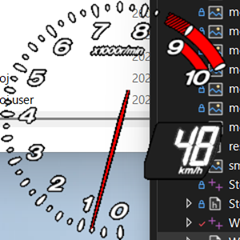

# WinTachos

CPU使用率とメモリ使用率をタコメーター・スピードメーター風に表示する Windows デスクトップウィジェットです。

## バリアント

| フォルダ | 説明 |
|----------|------|
| `WinTachos/` | オリジナル版(PS13)。スピードメーター（メモリ使用率）＋タコメーター（CPU使用率）の2メーター構成。 |
| `WinTachos_rx8/` | RX-8エディション。タコメーター1枚（CPU使用率）＋スピードメーター7セグメント表示（メモリ使用率%）構成。 |

## 特徴

- 透過ウィンドウ（カラーキー合成）でデスクトップに重ねて表示
- タスクトレイアイコンから設定・終了
- 表示サイズを5段階で変更可能
- 更新間隔・応答速度を設定可能
- 常に手前に表示オプション
- ウィンドウ位置をレジストリに保存・復元

## 動作要件

- Windows 10 以降（64ビット推奨）
- Visual C++ 再頒布可能パッケージ（ビルド済みバイナリを使用する場合）

## ビルド方法

1. Visual Studio 2022 をインストール（C++ デスクトップ開発ワークロード）
2. 使用するバリアントのフォルダ内の `WinTachos.sln` を開く
3. ソリューション構成を `Release` に設定してビルド

## 使い方

1. `WinTachos.exe` を起動するとデスクトップ上にメーターが表示されます
2. メーターを右クリックするとメニューが表示されます
   - **設定**: サイズ・更新間隔・レスポンスを変更
   - **設定を初期値に戻す**: 位置・設定をリセット
   - **終了**: アプリケーションを終了
3. メーターはドラッグで移動でき、位置は終了時に保存されます

## ライセンス

[MIT License](LICENSE)

## 作者

Copyright (c) 2001-2026 T.Murate  
https://github.com/murate-lab
